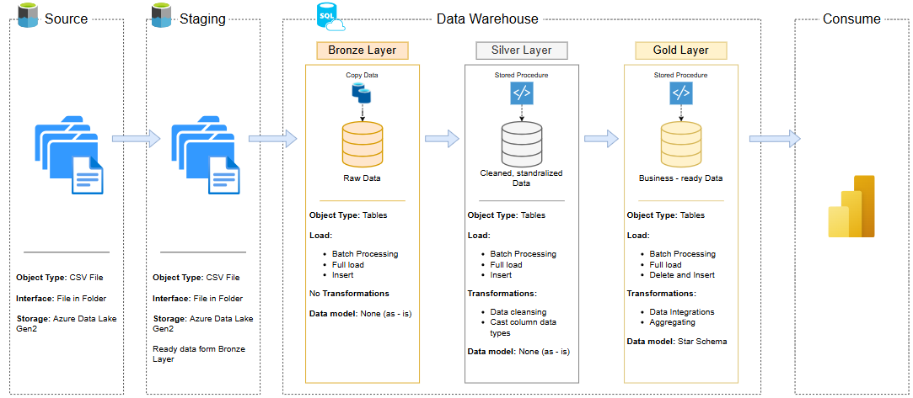
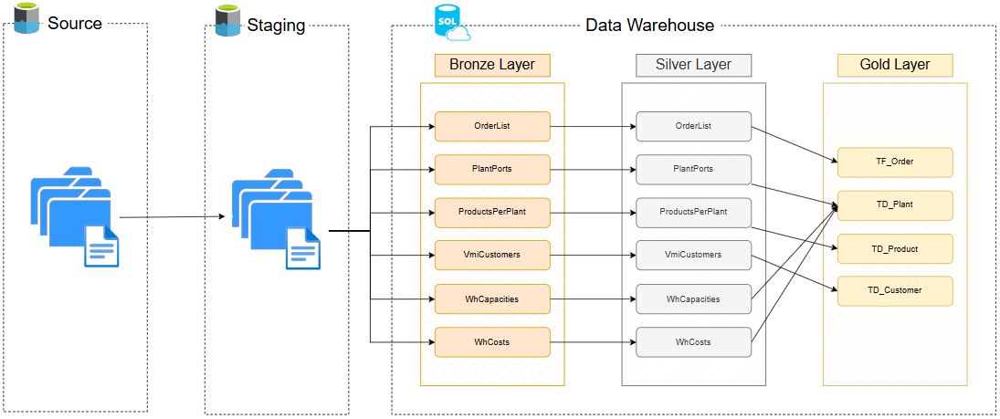

# 📌 Medallion Data Warehouse Architecture: End-to-End Azure ETL

## 1. Introduction
This project implements the **Medallion Data Warehouse Architecture** with three main data layers: **Bronze**, **Silver**, and **Gold**.  
The goal is to build an optimized **end-to-end ETL pipeline** on Azure for storing, processing, and analyzing data, ensuring that:
- Raw data is fully preserved.
- Data is cleaned and standardized.
- Data is integrated and ready for direct business analytics.

---
## 2. Data Architecture
The data architecture for this project follows Medallion Architecture Bronze, Silver, and Gold layers:

## 3. Data Flow Overview

### **🔹 Source Layer**
- **Object Type:** CSV File  
- **Interface:** File in Folder  
- **Storage:** Azure Data Lake Gen2  
- Contains raw data from the original sources.

### **🔹 Staging Layer**
- **Object Type:** CSV File  
- **Interface:** File in Folder  
- **Storage:** Azure Data Lake Gen2  
- Holds temporary data ready to be loaded into the Bronze Layer.

---

## 4. Data Warehouse Layers

### **🔹 Bronze Layer – Raw Data**
- **Object Type:** Tables  
- **Load:** Batch Processing, Full Load, Insert  
- **Transformations:** None (*as-is*)  
- **Data model:** None  
- **Purpose:** Preserve all raw data for traceability and recovery.

### **🔹 Silver Layer – Cleaned & Standardized Data**
- **Object Type:** Tables  
- **Load:** Batch Processing, Full Load, Insert  
- **Transformations:**
  - Data cleansing
  - Casting column data types  
- **Data model:** None  
- **Purpose:** Standardize and prepare data for integration and analysis.

### **🔹 Gold Layer – Business-ready Data**
- **Object Type:** Tables  
- **Load:** Batch Processing, Full Load, Delete and Insert  
- **Transformations:**
  - Data integrations
  - Business logics  
- **Data model:** Star Schema  
- **Purpose:** Provide final, business-ready data for reporting and analytics.

---

## 5. Technologies Used
- **Azure Data Factory** – Build and orchestrate the ETL pipeline.  
- **Azure Data Lake Gen2** – Store raw and staging data.  
- **Azure SQL Database** – Store Bronze, Silver, and Gold data as tables.  
- **SQL** – Execute queries, stored procedures, and data transformations.  
- **Power BI** – Visualize data and create reports.

---

## 6. Key Highlights
- **Clear separation of data layers** → easier management, maintenance, and scalability.  
- **Raw data is always preserved** → ensures traceability and auditability.  
- **Silver Layer for data standardization** → improves data quality.  
- **Gold Layer in Star Schema** → optimized for analytics and BI tools.
