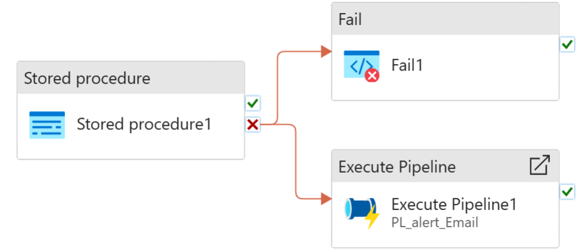
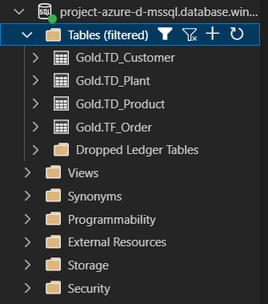

## Gold Layer Pipeline Overview
The diagram represents a pipeline in **Azure Data Factory (ADF)** for the Gold Layer with the following workflow:

1. **Stored procedure1**
   - Executes a stored procedure to transform the cleansed data from the **Silver Layer** into curated, business-ready datasets in the **Gold Layer**.
   - This step may include:
     - Aggregating and joining data across multiple tables.
     - Applying business logic and calculations.
     - Preparing data for reporting, analytics, and downstream applications.

2. **Fail1**
   - Triggered if **Stored procedure1** fails.
   - Stops the pipeline and logs the failure.

3. **Execute Pipeline1 – PL_alert_Email**
   - Also triggered when **Stored procedure1** fails.
   - Executes a separate pipeline responsible for sending email alerts to notify relevant stakeholders about the failure.

### Workflow Summary
`Stored procedure1 → On failure: Fail1 And Execute Pipeline1 (PL_alert_Email)`

