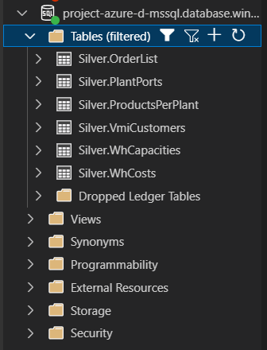

## Silver Layer Pipeline Overview
The diagram represents a pipeline in **Azure Data Factory (ADF)** for the Silver Layer with the following workflow:

1. **Lookup1**
   - Performs a **Lookup** activity to query the configuration table.
   - Retrieves parameters in both**source** and **sink** `table name` and `schema name` from the Bronze Layer and Silver Layer.
   - Passes these results to the **ForEach** activity.

2. **ForEach1**
   - Iterates through each item from the **Lookup1** output.
   - Contains two sub-activities:
     - **Stored procedure**: Executes a stored procedure to:
       - Remove duplicate records from the Bronze Layer tables.
       - Cast all columns back to their correct original data types.
     - **Pipeline_Failed_Alert**: Triggered when the stored procedure execution fails, sending an alert/notification.
     - **Fail2**: Executes if **Copy data1** fails, marking the error for that specific iteration.

3. **Fail2**
   - Executes if the **ForEach** activity fails completely or encounters a critical error.
   - Stops the pipeline and logs the failure.

### Workflow Summary

`Lookup1 → ForEach1 → (Stored procedure → On failure: Pipeline_Failed_Alert and Fail1) → If ForEach fails → Fail2`

