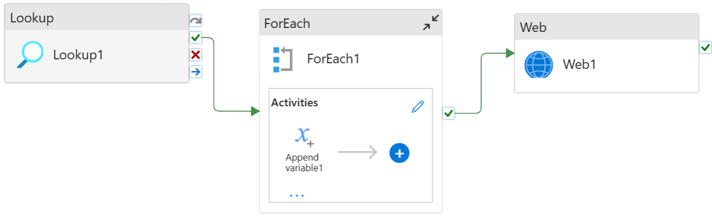

## Alert Pipeline Overview
This pipeline is responsible for generating and sending alerts using **Azure Logic Apps**.

### Workflow

1. **Lookup1**
   - Retrieves member information required for sending notifications.
   - The data includes:
     - **Name**
     - **Email**

2. **ForEach1**
   - Iterates over each member returned from `Lookup1`.
   - Inside the loop:
     - **Append variable1** → Stores the **Name** value.
     - **Append variable2** → Stores the **Email** value.

3. **Web1**
   - Sends an HTTP request to the **Azure Logic App** endpoint.
   - The request body contains:
     - `Name`
     - `Email`
   - The Logic App processes this data and sends the alert (e.g., via email).

### Summary Flow

`Lookup1 → ForEach1 (Append variable1: Name, Append variable2: Email) → Web1 (Trigger Logic App)`

